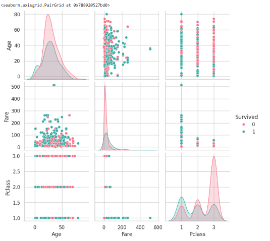

# 📊 Task 2 – Exploratory Data Analysis on Titanic Dataset | Elevate Labs Internship

## 📌 Objective
The goal of this project is to explore the Titanic dataset using statistical analysis and visualizations.  
The objective is to understand the structure, distribution, and relationships within the data to gain insights before building machine learning models.

---

## 📁 Dataset
[Titanic Dataset – Kaggle](https://www.kaggle.com/datasets/yasserh/titanic-dataset)

---

## 🔧 Steps Performed
- Loaded the dataset from Google Drive for good practice
- Checked data types and missing values
- Generated summary statistics:
  - Mean, Median, Standard Deviation
- Created visualizations:
  - Histograms, Boxplots for numeric features
  - Correlation Matrix and Pairplot
  - Countplots for categorical features
- Feature-level analysis (e.g., survival by gender, class, and port)
- Bonus analysis (Extra):
  - Skewness check
  - Missing value heatmap
  - Engineered `FamilySize` feature

---

## 📊 Key Insights
- Most passengers were in 3rd class and didn’t survive.
- Females and 1st class passengers had significantly higher survival rates.
- Fares are highly skewed with extreme outliers.
- Port C had the highest survival **rate**, but Port S had the most passengers.

---

## 🛠 Final Dataset State
- Original data mostly untouched (no imputation or encoding)
- One new feature added: `FamilySize = SibSp + Parch + 1`
- Dataset is still raw, intended for analysis only

---

## 📊 Visuals
### Correlation Heatmap

### Pairplot (Survival)

### Survival by Categorical Features (Gender, Class, Embarked)

### Missing Values Heatmap

---

## ✨ Going the Extra Mile
Though the task focused only on basic EDA, I chose to go further by:
- Checking skewness to understand data distribution
- Creating a new feature (`FamilySize`) for deeper insights
- Practicing storytelling through clear and simple observations

These steps were added to show initiative, thought process, and to mimic real-world data exploration practices.

---

## 🙋‍♀️ About Me
I'm Jaaie, an IT graduate currently reskilling through Elevate Labs' AI/ML internship.  
I aim to understand data deeply and apply best practices from industry — this project is part of that learning journey.

---

## 🔗 Submission
This project is submitted as part of the Elevate Labs AI/ML Internship – Task 2.

